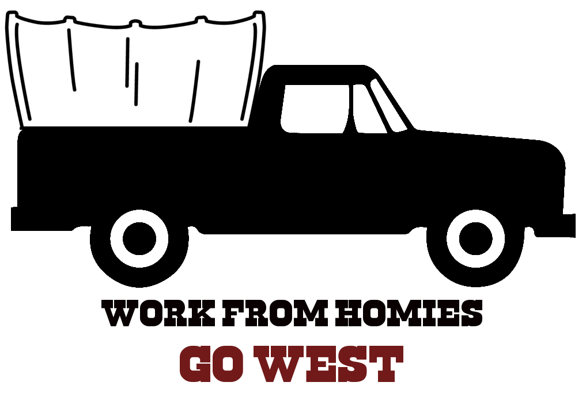
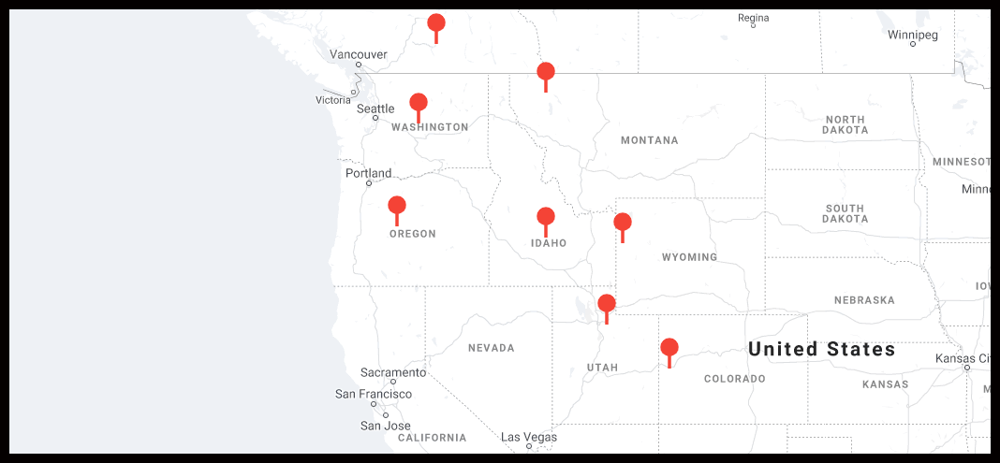

:::{.intro}

Take life to the road and see the great parks of the West with an eight week
tour of the West's best parks and co-working spaces.

:::

## Living

This vehicle-based adventure will be putting us in some of the grandest
parks in the North American continent with camping close enough to towns
that the trip can be done without a single night spent under a proper roof.

## Working

Each stop has been based around the availability of a fully provisioned co-working
space with the amenities you need to focus on your job when it's time to work.

Daily drop in fees are usually fairly pricey for a good coworking space,
but with group rate negotiation and week-long commitments its looking
like we'll be able to get down to get in the neighborhood of $100 per
week per desk.

## Playing

With trails, lakes and climbing routes available at just about every stop there
won't be any lack of ways to go get after it when the day's work is done.

## Itinerary

:::{.places}
### Week 1: Jackson Hole, WY / Grand Tetons Ntl Park

The trip begins with an 8 hour drive from Boulder to Jackson Hole, WY where we'll
be in the midst of the Teton mountains.

#### Living

[Curtis Canyon Campground](https://www.rei.com/campgrounds/camp/115209745/curtis-canyon-campground)
has a righteous view, and an almost as righteous 8 mile commute into Jackson proper.

#### Playing

[Mountain Biking](https://www.mtbproject.com/trail/4107927/game-creek-loop),
[Hiking](https://www.hikingproject.com/search?q=jackson%20wy%27),
[Climbing](https://www.mountainproject.com/search?q=jackson%20wy) options right around
Jackson proper look incredible.  Grand Teton Ntl. park is nearby.

#### Working

[The Silicon Couloir Co-Work Space](https://www.siliconcouloir.com/the-cowork-space-info)
has a promising looking location right downtown.

### Week 2: Whitefish, MT / Glacier Ntl Park
### Week 3: Kelowna, CA / Graystokes Prov Park
### Week 4: Wenatchee, WA / Okanogan Ntl Forest
### Week 5: Bend, OR / Williamette Ntl Forest
### Week 6: Ketchum ID / Sawtooth Ntl Forest
### Week 7: Park City UT / Uinta Ntl Forest
### Week 8: Grand Junction CO / Colorado Ntl Monument
:::
